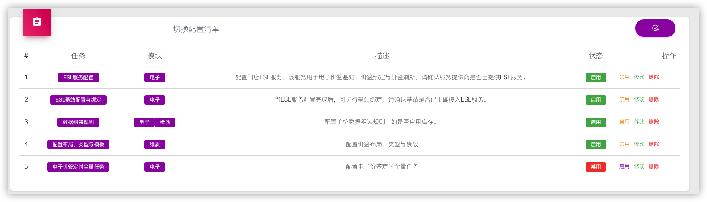

# 切换配置清单

## 概述

切换配置清单为系统中的多个配置项，每一项或多项配置共同组织成一个最小配置单元。

## 切换配置条目

**切换条目**为价签系统中一条切换配置项，即配置的最小操作单元或最小操作单元的组合。

| 属性     | 描述                           | 是否非空 | 说明             |
| -------- | ------------------------------ | -------- | ---------------- |
| 名称     | 切换配置的名称                 | Y        |                  |
| 模块     | 配置所属模块：电子｜纸质｜磅秤 | Y        | 至少一种，可多种 |
| 描述     | 切换配置功能描述               | Y        |                  |
| 状态     | 配置条目的状态：启有｜禁用     | Y        | 默认启用         |
| 配置页面 | 配置操作页面路径               | N        | 相对路径         |
| 是否     | 配置是否可能跳过               | N        |                  |
|          |                                |          |                  |

## 切换配置清单

切换配置清单以列表的形式展示系统中的**切换配置条目**。

