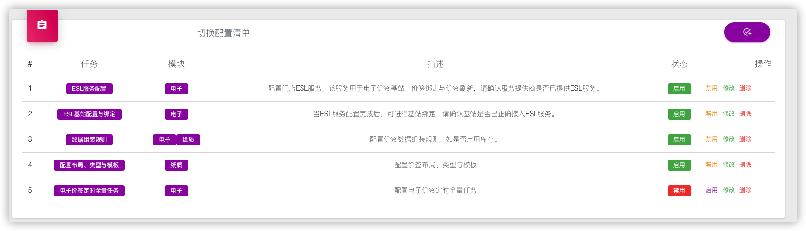
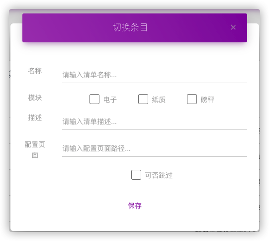

# 切换配置项

## 概述

切换配置项为系统中的多个配置项，每一项或多项配置共同组织成一个最小配置单元。

## 切换配置项

**切换条目**为价签系统中一条切换配置项，即配置的最小操作单元或最小操作单元的组合。

| 属性     | 描述                           | 是否非空 | 说明             |
| -------- | ------------------------------ | -------- | ---------------- |
| 名称     | 切换配置的名称                 | Y        |                  |
| 模块     | 配置所属模块：电子｜纸质｜磅秤 | Y        | 至少一种，可多种 |
| 描述     | 切换配置功能描述               | Y        |                  |
| 状态     | 配置条目的状态：启有｜禁用     | Y        | 默认启用         |
| 配置页面 | 配置操作页面路径               | N        | 相对路径         |
| 是否     | 配置是否可能跳过               | N        |                  |
|          |                                |          |                  |

## 切换配置项清单

切换配置清单以列表的形式展示系统中的**切换配置项**。

## 新增/修改配置项

在切换配置清单列表的右上角，通过按钮<button class="btn btn-round btn-sm btn-primary" data-toggle="modal" data-target="#addSwitchPlan"><i class="material-icons">add_task</i></button>
进行配置条目的新增，或通过配置清单的操作“修改”对已有配置条目进行修改。

交互方式：Model框

## 系统配置条目

| 名称                     | 模块       | 可选 | 备注                                                         |
| ------------------------ | ---------- | ---- | ------------------------------------------------------------ |
| 电子价签使用新流程       | 电子       | Y    | 当新商家首次接入时，需要配置电子价签是否使用新流程           |
| 电子价签ESL服务地址      | 电子       | N    | 当新门店接入时，必须配置电子价签ESL服务                      |
| 电子价签基站配置与绑定   | 电子       | N    | 当新门店接入时，必做配置基站并绑定                           |
| 价签数据组装             | 电子、纸质 | N    | 当商家或门店与系统默认数据组装规则不一致时，需要配置商家或门店的数据组装规则 |
| 电子价签模板             | 电子       | Y    | 当新门店接入时，如果模板有定制，需要重新设计模板并上传       |
| 纸质价签布局、类型、模板 | 纸质       | Y    | 当新门店接入时，如果模板有定制，需要重新设计模板             |
| 电子价签定时全量刷新任务 | 电子       | Y    | 当新门店需要启动电子价签定时全量刷新任务时，需要配置         |
| 电子价签绑定与推送验证   | 电子       | Y    | 当切换配置完成后，校验电子价签是否可正常绑定与刷新           |
| 纸质价签查询与打印       | 纸质       | Y    | 当切换配置完成后，检查纸质价签是否可以查询及正常打印         |

